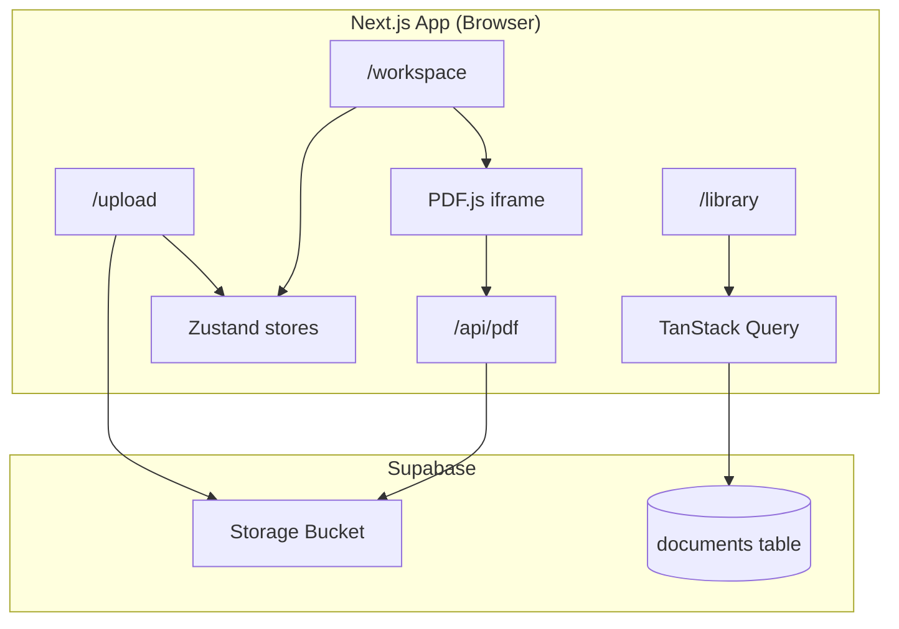
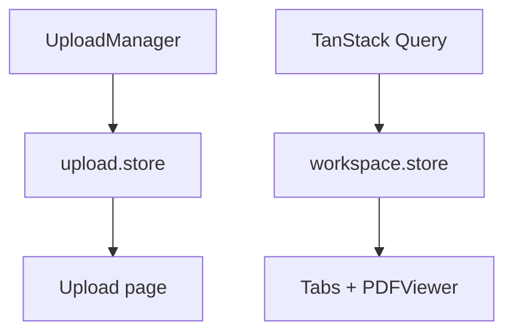
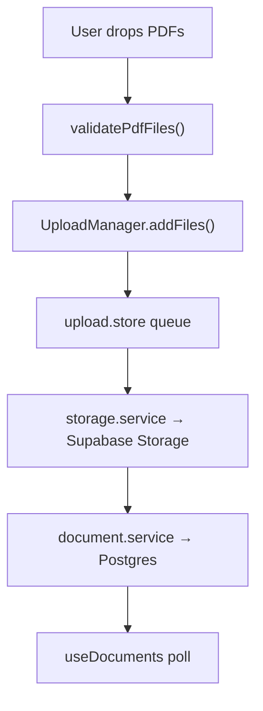
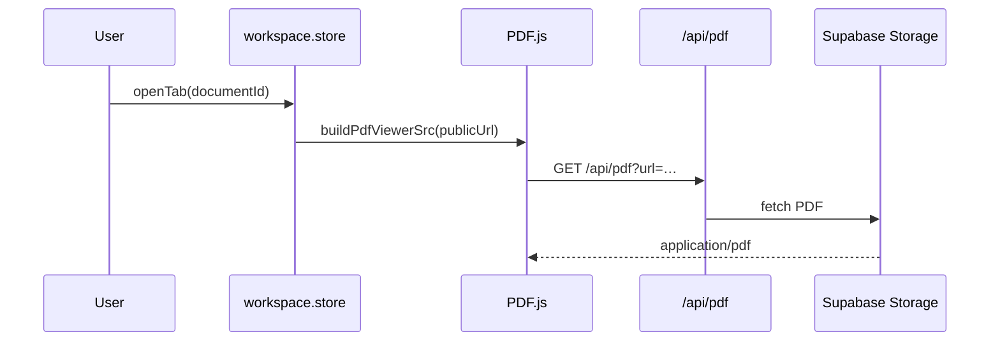
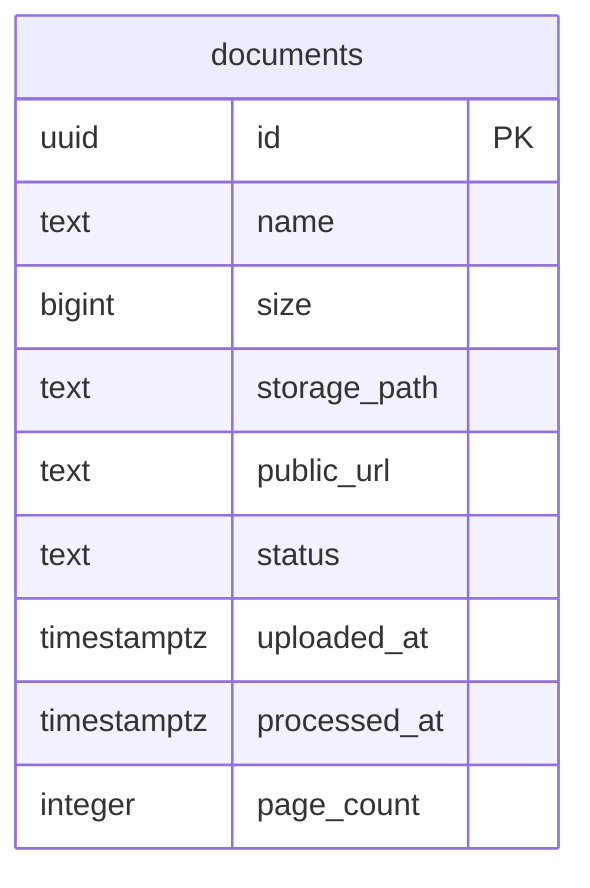
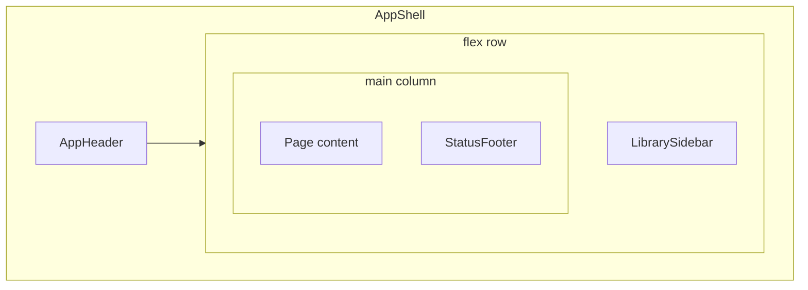
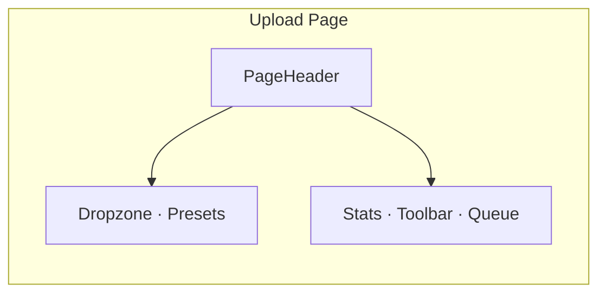
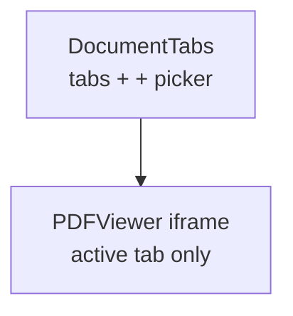

# DocIntel AI — Architecture & UI

Technical documentation for the DocIntel AI POC: how the app is structured, how data flows, and how the interface is built.

> Mermaid source files: [docs/diagrams/](./docs/diagrams/)

---

## System overview



See also: [system-overview.mmd](./docs/diagrams/system-overview.mmd)

The frontend is a **single Next.js application**. There is no separate backend service; Supabase is the BaaS layer, and Next.js API routes handle the PDF proxy.

---

## Application layers

### 1. Routes (`src/app/`)

| Route | Purpose |
|-------|---------|
| `/upload` | Bulk PDF upload queue and dropzone |
| `/library` | Document list and open actions |
| `/workspace` | Multi-tab PDF viewer |
| `/api/pdf` | Proxies Supabase storage URLs for PDF.js |

All authenticated-style pages share `ShellLayout` → `AppShell` (header, sidebar, footer).

### 2. State management

**Zustand** — client UI state that must be instant and shared across components:

| Store | Responsibility |
|-------|----------------|
| `upload.store` | Upload queue items, filters, concurrency, pause state |
| `workspace.store` | Open tabs, active document ID, document list mirror |

**TanStack Query** — server-backed document list:

- `useDocuments` fetches from Supabase, syncs into `workspace.store`
- Polls every 3s while any document is `uploading` or `processing`



See: [state-management.mmd](./docs/diagrams/state-management.mmd)

### 3. Services (`src/services/`)

| Service | Role |
|---------|------|
| `storage.service` | XHR upload to Supabase Storage REST API with progress events |
| `document.service` | CRUD on `documents` table; maps DB rows to `Document` type |

### 4. Upload pipeline



See: [upload-pipeline.mmd](./docs/diagrams/upload-pipeline.mmd)

`UploadManager` emits progress events; `upload.store` subscribes and updates the virtualized queue UI.

### 5. Workspace & PDF viewing



See: [pdf-viewer-flow.mmd](./docs/diagrams/pdf-viewer-flow.mmd)

**Why the proxy?** PDF.js blocks cross-origin `file=` URLs. The proxy makes the PDF same-origin while restricting fetches to Supabase storage paths only.

**Tab state:** `useWorkspaceTabs` prunes stale tab IDs when documents are deleted and exposes `visibleTabs` for rendering.

---

## Key hooks

| Hook | Purpose |
|------|---------|
| `useUploadQueue` | Upload page: queue actions + stats |
| `useDocuments` | Fetch/sync documents from Supabase |
| `useWorkspaceTabs` | Tab bar + viewer wiring |
| `useOpenDocument` | Open tab + navigate to `/workspace` |
| `useAnchoredMenu` | Position the document picker dropdown |
| `useClickOutside` | Dismiss picker on outside click |
| `usePersistedBoolean` | Sidebar collapsed state in `localStorage` |

---

## Shared components

| Component | Used by |
|-----------|---------|
| `PageHeader` | Upload, Library |
| `NavLink` / `navLinkClassName` | AppHeader, LibrarySidebar |
| `EmptyState` | Library empty list |
| `DocumentTab` | Workspace tab bar |
| `DocumentPickerMenu` | Workspace "+" dropdown |
| `ShellLayout` | Upload, Library, Workspace layouts |

Document eligibility rules live in `utils/document-status.ts` so Library, picker, and viewer stay consistent.

---

## Database schema



Document status lifecycle: [document-status.mmd](./docs/diagrams/document-status.mmd)

```sql
documents (
  id            uuid PRIMARY KEY,
  name          text,
  size          bigint,
  storage_path  text,
  public_url    text,
  status        text,  -- uploading | processing | ready | failed
  uploaded_at   timestamptz,
  processed_at  timestamptz,
  page_count    integer
)
```

Storage bucket: `documents` (configurable via env). Migration: `supabase/migrations/20240628000000_documents_and_storage.sql`.

---

## UI & design system

### Layout chrome



See: [app-shell-layout.mmd](./docs/diagrams/app-shell-layout.mmd) · [page-layouts.mmd](./docs/diagrams/page-layouts.mmd)

- Sidebar defaults to **collapsed**; state persisted in `localStorage`.
- Main pages use full-height flex columns with `min-h-0` so inner panels scroll correctly.

### Design tokens (`src/app/globals.css`)

Based on the **Synthesized Intelligence** palette:

| Token | Usage |
|-------|--------|
| `primary-container` | Buttons, active nav, PDF tab accent (`#4F46E5`) |
| `surface-container-*` | Background layers, cards, table headers |
| `on-surface` / `on-surface-variant` | Body text hierarchy |
| `border` | Dividers, table borders |

Typography scale: `headline-lg/md`, `body-md/sm`, `label-md` — Inter font.

### Upload page UI



- Status chips: Queued, Uploading, AI Processing, Failed (semantic colors)
- Slim 4px progress bars; circular icon action buttons per row

### Library page UI

- `PageHeader` + upload CTA
- Data table: name (with icon), size, status chip, **Open** button
- `EmptyState` when no documents

### Workspace UI



- Active tab: white elevated card, **bold indigo** filename, close **×**
- Inactive tabs: muted gray text
- **+** opens picker menu (positioned left of button) with openable docs + library/upload links
- Tab width scales down as count increases (`utils/document-tabs.ts`)

---

## Folder structure (detailed)

```text
src/
├── app/
│   ├── upload/          page + ShellLayout
│   ├── library/         page + ShellLayout
│   ├── workspace/       page + ShellLayout
│   └── api/pdf/         Supabase PDF proxy route
├── components/
│   ├── layout/          AppShell, AppHeader, Sidebar, PageHeader, NavLink
│   ├── upload/          Dropzone, Queue, Toolbar, StatsBar, UploadItem
│   ├── workspace/       DocumentTabs, DocumentTab, PDFViewer, PickerMenu
│   ├── icons/           DocumentTabIcons (PDF / file SVGs)
│   └── ui/              Button, Badge, Input, EmptyState, …
├── hooks/               Custom hooks (see table above)
├── lib/
│   ├── upload-manager.ts
│   ├── pdf-viewer.ts
│   └── supabase.ts
├── services/
├── store/
├── types/
└── utils/
    ├── document-status.ts
    └── document-tabs.ts

public/pdfjs/            Vendored PDF.js viewer (generated by setup:pdfjs)
supabase/migrations/     SQL schema + RLS policies
scripts/                 PDF.js setup, DB migration runner
```

---

## Security notes (POC scope)

- `/api/pdf` only allows URLs from the configured Supabase host with `/storage/v1/object/` paths.
- RLS policies on `documents` are permissive for anon (POC/demo); tighten for production.
- `.env.local` is gitignored; never commit Supabase keys.

---

## Extension points

| Area | Natural next step |
|------|-------------------|
| Auth | Supabase Auth + per-user RLS on `documents` |
| AI | Document-scoped chat sheet (layout already designed for right panel) |
| Processing | Webhook or Edge Function to update `status` and `page_count` |
| Deploy | Vercel + Supabase; run `setup:pdfjs` in build step |

---

## Related docs

- [README.md](./README.md) — Features, quick start, demo script
- [docs/diagrams/](./docs/diagrams/) — All Mermaid diagram sources
