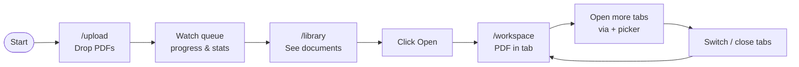
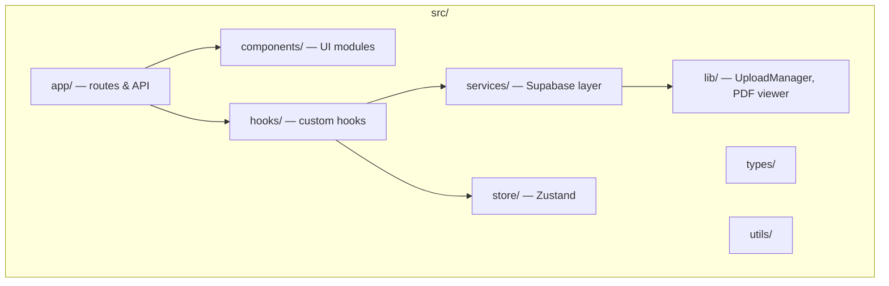

# DocIntel AI

A **proof-of-concept** document intelligence workspace for uploading PDFs, managing a document library, and viewing files in a multi-tab PDF viewer. Built to demonstrate frontend architecture, state management, Supabase integration, and production-style UI patterns.

> **For interviewers:** See [ARCHITECTURE.md](./ARCHITECTURE.md) for system design, data flow, and UI documentation.  
> **Diagrams:** [docs/diagrams/](./docs/diagrams/) (Mermaid source files)

---

## User journey



---

## Features

### Bulk upload (`/upload`)

- Drag-and-drop or file/folder picker for PDFs
- Client-side validation (type, size)
- Upload queue with per-file progress, pause/resume, cancel, and retry
- Summary stats bar (Total, Uploading, Queued, Completed, Failed)
- Search and filter within the queue
- Configurable upload concurrency via `UploadManager`
- Direct upload to **Supabase Storage** with metadata saved to Postgres

### Document library (`/library`)

- Table of all uploaded documents (name, size, status)
- Status chips: `uploading` → `processing` → `ready` / `failed`
- **Open** action opens the document in the workspace viewer
- Empty state with CTA to upload first PDF

### Tabbed PDF workspace (`/workspace`)

- Browser-style tabs for multiple open documents
- Tabs shrink automatically when many are open
- **+** picker to open closed documents from the library
- Official **PDF.js** viewer embedded via iframe
- Same-origin PDF proxy (`/api/pdf`) for Supabase URLs (avoids CORS)
- Empty state when no tabs are open

### App shell

- Top nav: **Upload** · **Library** · **Viewer**
- Collapsible sidebar (Library link; collapsed by default)
- Status footer
- **Synthesized Intelligence** design tokens (indigo primary, surface hierarchy)

---

## Tech stack

| Layer | Choice |
|-------|--------|
| Framework | Next.js 16 (App Router) |
| Language | TypeScript |
| Styling | Tailwind CSS 4 + custom design tokens |
| Client state | Zustand |
| Server/async state | TanStack React Query |
| Storage & DB | Supabase (Storage + Postgres) |
| PDF rendering | PDF.js viewer (`public/pdfjs`, installed via `setup:pdfjs`) |
| Upload UX | `react-dropzone`, custom `UploadManager` |

---

## Quick start

### Prerequisites

- Node.js 20+
- npm
- (Optional) Supabase project for real uploads

### Install & run

```bash
npm install          # also runs setup:pdfjs (copies PDF.js viewer assets)
cp .env.example .env.local
npm run dev
```

Open [http://localhost:3000](http://localhost:3000) — redirects to `/upload`.

### Supabase setup (optional)

1. Create a Supabase project.
2. Copy URL and anon key into `.env.local` (see `.env.example`).
3. Run the migration:

```bash
# Set SUPABASE_DB_PASSWORD or DATABASE_URL in .env.local
npm run db:migrate
```

Without Supabase, the app falls back to **mock/local** document storage for UI demos.

---

## Demo walkthrough (for interviews)

1. **Upload** — Drop 2–3 PDFs; show queue progress and stats.
2. **Library** — Confirm documents appear with `ready` status; click **Open**.
3. **Viewer** — Show multiple tabs, switch between documents, use **+** to open another file.
4. **Architecture talking points** — Upload manager concurrency, Zustand tab state, PDF proxy, shared hooks/components (see ARCHITECTURE.md).

---

## Scripts

| Command | Description |
|---------|-------------|
| `npm run dev` | Development server |
| `npm run build` | Production build |
| `npm run lint` | ESLint |
| `npm run setup:pdfjs` | Copy PDF.js viewer into `public/pdfjs` |
| `npm run db:migrate` | Apply Supabase SQL migration |

---

## Project structure (high level)



```
src/
├── app/           # Routes: upload, library, workspace, api/pdf
├── components/    # UI, layout, upload, workspace modules
├── hooks/         # useDocuments, useWorkspaceTabs, useUploadQueue, …
├── lib/           # UploadManager, Supabase client, PDF viewer URL builder
├── services/      # Storage & document API layer
├── store/         # Zustand stores (upload, workspace)
├── types/         # Shared TypeScript types
└── utils/         # Validation, document status, tab layout helpers
```

Full diagrams: [docs/diagrams/](./docs/diagrams/)

---

## Environment variables

See [`.env.example`](./.env.example). Required for production uploads:

- `NEXT_PUBLIC_SUPABASE_URL`
- `NEXT_PUBLIC_SUPABASE_ANON_KEY`
- `NEXT_PUBLIC_SUPABASE_STORAGE_BUCKET`

---

## License

POC — for demonstration purposes.
